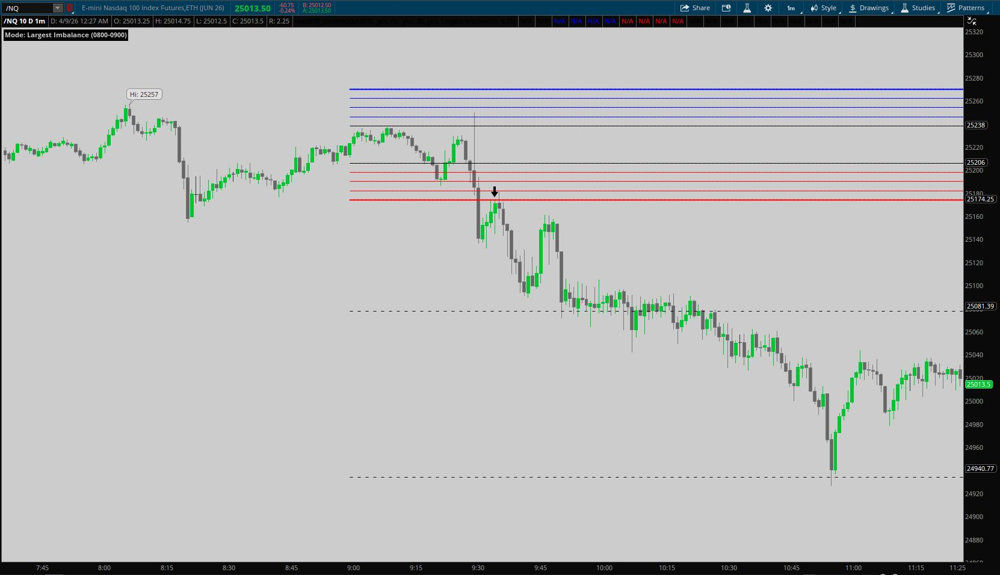
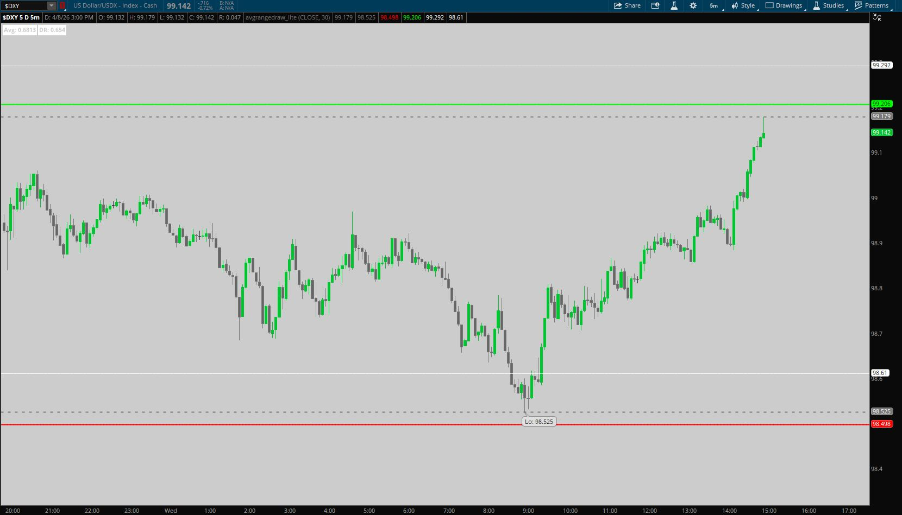
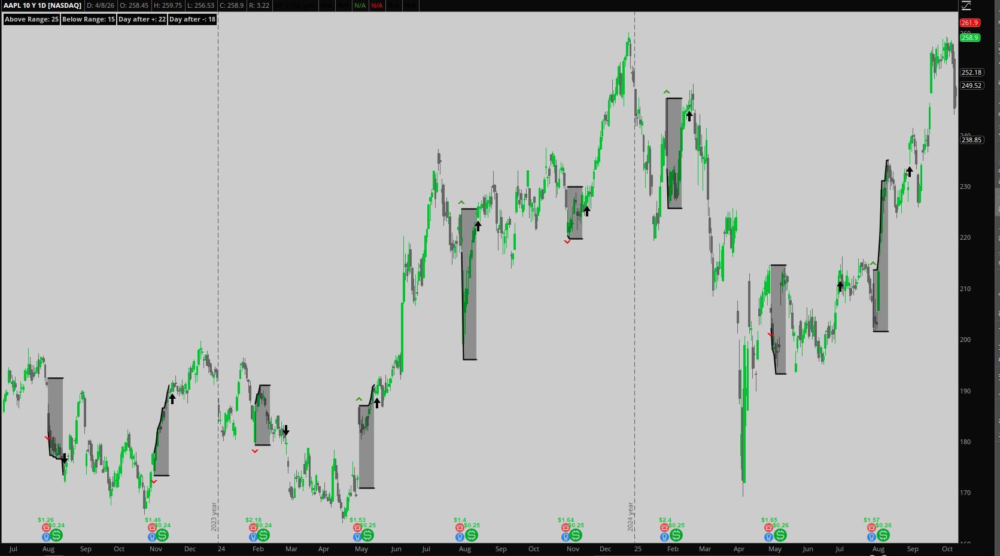
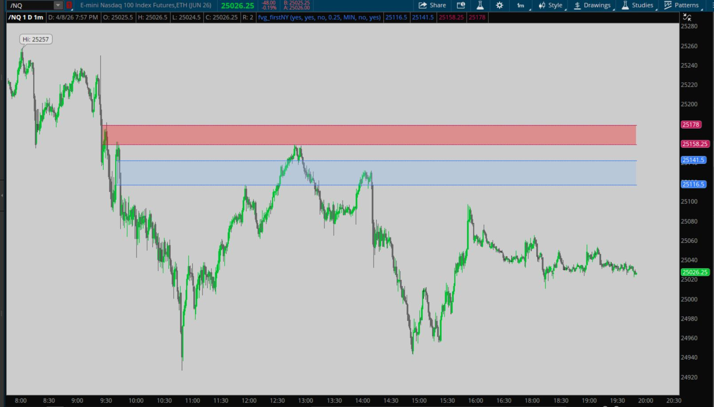
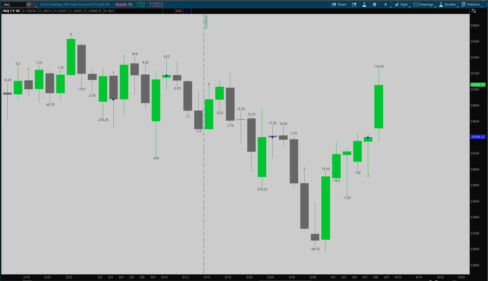
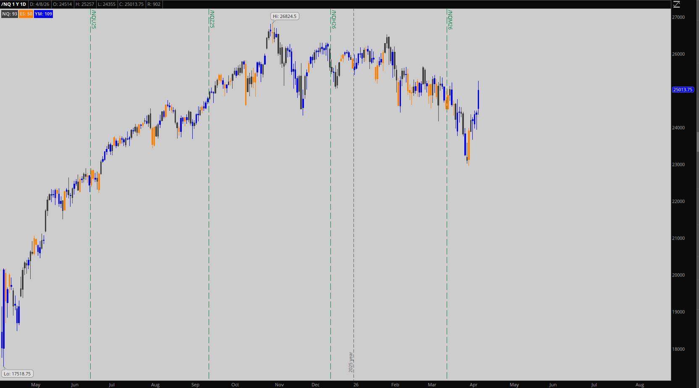
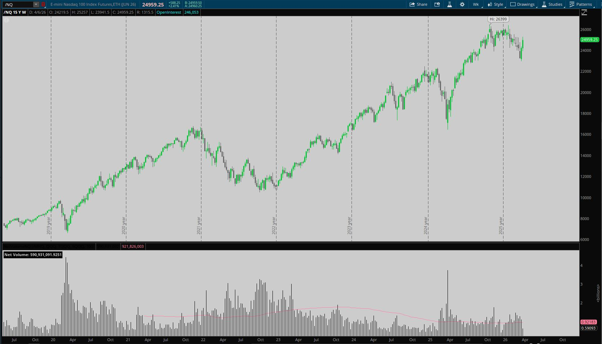
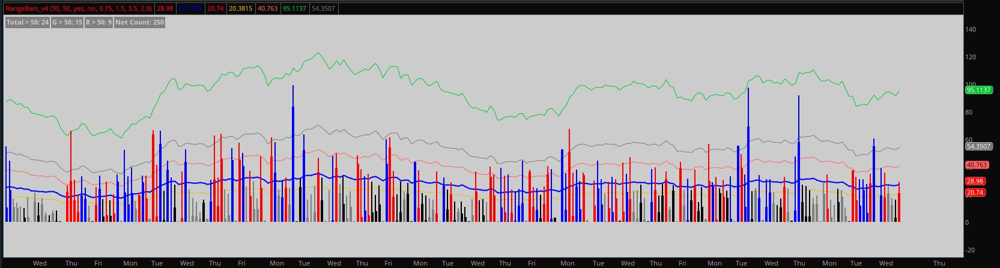
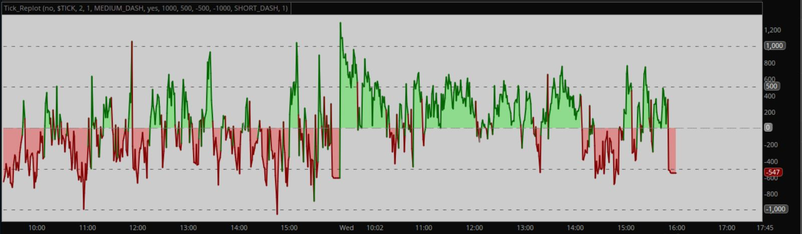
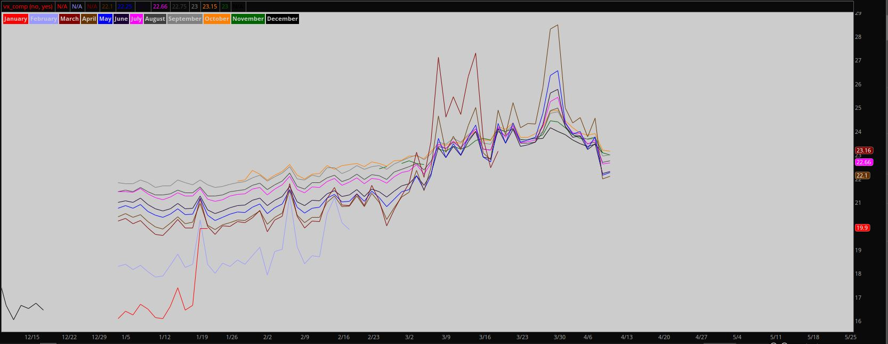

## Thinkscript Index

| Preview | Indicator | File |
| --- | --- | --- |
|  | `830_Data_TradeModel` | [`scripts/indicators/830_Data_TradeModel.thinkscript`](scripts/indicators/830_Data_TradeModel.thinkscript) |
|  | `AverageRangeDraw_lite` | [`scripts/indicators/AverageRangeDraw_lite.thinkscript`](scripts/indicators/AverageRangeDraw_lite.thinkscript) |
|  | `Earnings_Breakout` | [`scripts/indicators/Earnings_Breakout.thinkscript`](scripts/indicators/Earnings_Breakout.thinkscript) |
|  | `FirstNY_FVG` | [`scripts/indicators/FirstNY_FVG.thinkscript`](scripts/indicators/FirstNY_FVG.thinkscript) |
|  | `GapDistance_Threshold` | [`scripts/indicators/GapDistance_Threshold.thinkscript`](scripts/indicators/GapDistance_Threshold.thinkscript) |
|  | `Leadership_Detection` | [`scripts/indicators/Leadership_Detection.thinkscript`](scripts/indicators/Leadership_Detection.thinkscript) |
|  | `NetVolume_NQ` | [`scripts/indicators/NetVolume_NQ.thinkscript`](scripts/indicators/NetVolume_NQ.thinkscript) |
|  | `RangeBars_v4` | [`scripts/indicators/RangeBars_v4.thinkscript`](scripts/indicators/RangeBars_v4.thinkscript) |
|  | `Tick_Replot` | [`scripts/indicators/Tick_Replot.thinkscript`](scripts/indicators/Tick_Replot.thinkscript) |
|  | `drawdown-from-all-time-high` | [`scripts/indicators/drawdown-from-all-time-high.thinkscript`](scripts/indicators/drawdown-from-all-time-high.thinkscript) |
|  | `vx_comp` | [`scripts/indicators/vx_comp.thinkscript`](scripts/indicators/vx_comp.thinkscript) |
